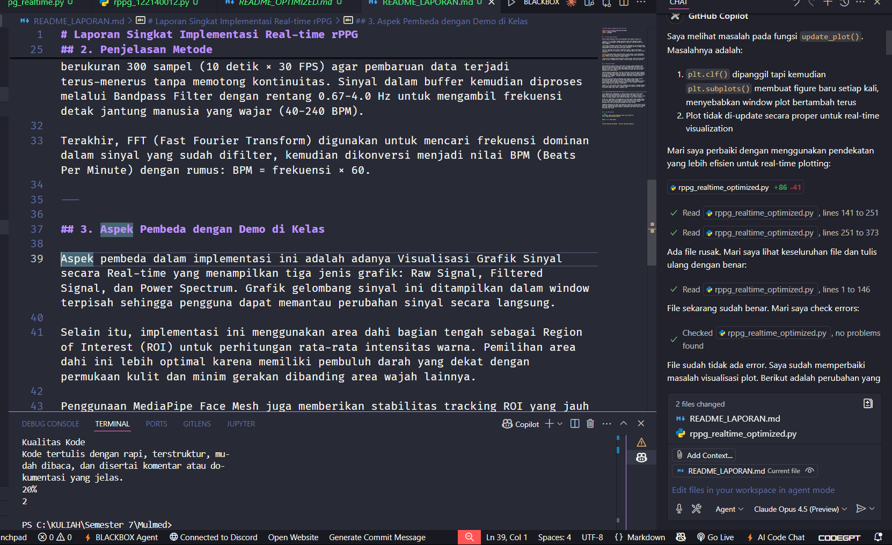

# Laporan Singkat Implementasi Real-time rPPG

**Mata Kuliah:** Sistem & Teknologi Multimedia  
**Nama:** Ferdana Al Hakim  
**NIM:** 122140012

---

## 1. Pustaka yang Digunakan

Berikut adalah beberapa library yang digunakan untuk membuat program ini:

**OpenCV (cv2)** berfungsi sebagai antarmuka utama untuk mengakses webcam, memanipulasi frame gambar, dan menampilkan visualisasi (teks dan grafik) ke layar pengguna.

**MediaPipe** digunakan untuk deteksi wajah dan penentuan titik koordinat wajah (face landmarks) secara presisi. Library ini menyediakan 468 titik landmark yang memungkinkan ekstraksi ROI yang akurat pada area dahi.

**NumPy** digunakan untuk operasi matematika numerik, seperti perhitungan rata-rata kanal warna, manipulasi array, dan mendukung operasi FFT (Fast Fourier Transform).

**SciPy** berfungsi khusus untuk pemrosesan sinyal digital, yaitu menyediakan fitur Bandpass Filter (Butterworth) untuk memisahkan sinyal detak jantung dari noise, serta FFT untuk estimasi frekuensi dominan.

**Matplotlib** digunakan untuk visualisasi grafik sinyal secara real-time dalam window terpisah, menampilkan Raw Signal, Filtered Signal, dan Power Spectrum.

---

## 2. Penjelasan Metode

Program berjalan secara kontinu (real-time). Pertama, webcam menangkap video pada 30 FPS dan MediaPipe mendeteksi area wajah menggunakan Face Mesh untuk menentukan Region of Interest (ROI) pada bagian dahi. Area dahi dipilih karena memiliki kulit tipis dengan pembuluh darah dekat permukaan dan minim gerakan dibanding area wajah lainnya.

Program kemudian mengekstraksi rata-rata intensitas warna Hijau (Green Channel) dari area tersebut karena kanal ini memiliki respons terkuat terhadap perubahan aliran darah. Hemoglobin dalam darah memiliki penyerapan yang kuat pada panjang gelombang hijau (~540nm), sehingga perubahan volume darah terdeteksi paling jelas pada kanal ini.

Data sinyal mentah tersebut dikumpulkan dalam sebuah sliding window (buffer) berukuran 300 sampel (10 detik × 30 FPS) agar pembaruan data terjadi terus-menerus tanpa memotong kontinuitas. Sinyal dalam buffer kemudian diproses melalui Bandpass Filter dengan rentang 0.67-4.0 Hz untuk mengambil frekuensi detak jantung manusia yang wajar (40-240 BPM).

Terakhir, FFT (Fast Fourier Transform) digunakan untuk mencari frekuensi dominan dalam sinyal yang sudah difilter, kemudian dikonversi menjadi nilai BPM (Beats Per Minute) dengan rumus: BPM = frekuensi × 60.

---

## 3. Aspek Pembeda dengan Demo di Kelas

Aspek pembeda dalam implementasi ini adalah adanya Visualisasi Grafik Sinyal secara Real-time yang menampilkan tiga jenis grafik: Raw Signal, Filtered Signal, dan Power Spectrum. Grafik gelombang sinyal ini ditampilkan dalam window terpisah sehingga pengguna dapat memantau perubahan sinyal secara langsung.

Selain itu, implementasi ini menggunakan area dahi bagian tengah sebagai Region of Interest (ROI) untuk perhitungan rata-rata intensitas warna. Pemilihan area dahi ini lebih optimal karena memiliki pembuluh darah yang dekat dengan permukaan kulit dan minim gerakan dibanding area wajah lainnya.

Penggunaan MediaPipe Face Mesh juga memberikan stabilitas tracking ROI yang jauh lebih baik dibandingkan metode deteksi wajah berbasis bounding box biasa. Dengan 468 titik landmark, ROI dapat mengikuti pergerakan wajah secara akurat tanpa kehilangan area target.

---

## 4. Credit AI

